# System Architecture

## Overview

The ABB Agentic Customer Support application follows a serverless architecture using Firebase services and Google AI.

## Architecture Diagram

```mermaid
flowchart TB
    subgraph Frontend["Frontend (Firebase Hosting)"]
        UI["🖥️ Web Application<br/>HTML + Tailwind CSS"]
        Browser["📱 Product Browser<br/>Category Navigation"]
        Chat["💬 Chat Interface<br/>AI Q&A"]
    end

    subgraph CloudFunctions["Cloud Functions (Python 3.11)"]
        Search["🔍 search_products<br/>Category → Products"]
        Ingest["📄 ingest_manual<br/>PDF → Gemini Upload"]
        Agent["🤖 chat_agent<br/>Question → Answer"]
    end

    subgraph External["External Services"]
        ABB["📚 ABB Library<br/>library.abb.com"]
        Gemini["🧠 Google Gemini<br/>2.0 Flash"]
        Firebase["🔥 Firebase Admin<br/>Auth & Config"]
    end

    UI --> Browser
    UI --> Chat
    Browser -->|"POST /search_products"| Search
    Chat -->|"POST /ingest_manual"| Ingest
    Chat -->|"POST /chat_agent"| Agent
    
    Search -->|"Scrape Products"| ABB
    Ingest -->|"Download PDF"| ABB
    Ingest -->|"Upload File"| Gemini
    Agent -->|"Generate Response"| Gemini
    
    Search -.->|"Config"| Firebase
    Ingest -.->|"Secrets"| Firebase
    Agent -.->|"Secrets"| Firebase
```



## Component Details

### Frontend Layer

| Component | Technology | Purpose |
|-----------|------------|---------|
| Web Application | HTML5, Tailwind CSS | Main user interface |
| Product Browser | JavaScript | Navigate product categories |
| Chat Interface | JavaScript | AI-powered Q&A |

### Backend Layer (Cloud Functions)

| Function | Runtime | Memory | Timeout | Purpose |
|----------|---------|--------|---------|---------|
| `search_products` | Python 3.11 | 256MB | 60s | Search ABB Library |
| `ingest_manual` | Python 3.11 | 1GB | 300s | Process PDF documents |
| `chat_agent` | Python 3.11 | 256MB | 60s | Generate AI responses |

### External Services

| Service | Provider | Purpose |
|---------|----------|---------|
| ABB Library | ABB Ltd | Product documentation source |
| Gemini 2.0 Flash | Google AI | Document understanding & chat |
| Firebase | Google | Hosting, functions, secrets |

## Data Flow

### 1. Product Search Flow

```
User → Select Category → search_products → ABB Library → Parse HTML → Return Products
```

### 2. Document Ingestion Flow

```
User → Click Chat → ingest_manual → Download PDF → Upload to Gemini → Return File URI
```

### 3. Chat Flow

```
User → Ask Question → chat_agent → Gemini API → Generate Response → Return Answer
```

## Security Considerations

- **API Keys**: Stored as Firebase Secrets, not in code
- **CORS**: Configured for allowed origins
- **No User Data Storage**: Stateless architecture
- **HTTPS Only**: All communications encrypted

## Scalability

- **Auto-scaling**: Cloud Functions scale automatically
- **Cold Start**: ~2-3 seconds for Python functions
- **Concurrent Requests**: Up to 1000 per function
- **Regional Deployment**: us-central1 (configurable)

## Cost Optimization

- **Pay-per-use**: Only charged for actual invocations
- **Memory Optimization**: Minimal memory for simple functions
- **Caching**: Browser caches static assets
- **CDN**: Firebase Hosting uses global CDN

